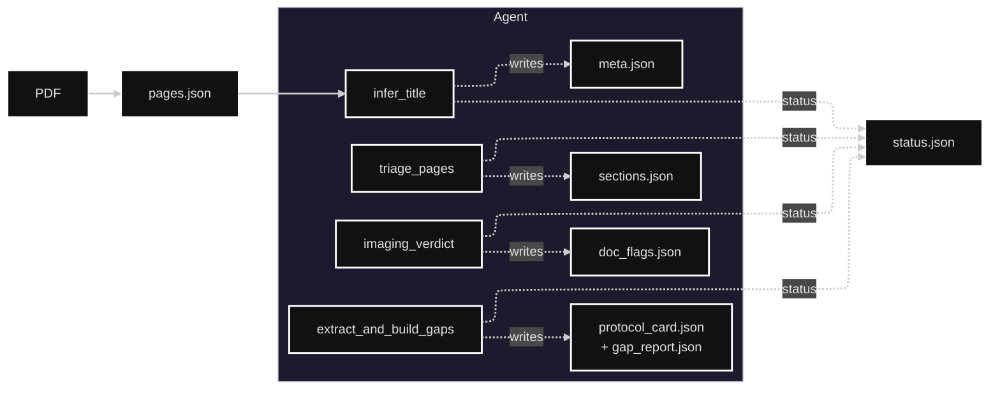

# Protocol Pilot (lite)

Protocol Pilot lets you upload a scientific PDF, detect whether it contains medical imaging methods, triage relevant pages, extract protocol parameters using an LLM, and render a Protocol Card and Gap Report in a small web UI.

Note: The current extraction flow and prompts are MRI‑focused.

## Quickstart

- Prerequisites: Python 3.10+, a working C toolchain (for some deps), and optionally an LLM server (Ollama recommended).
- Install deps:
  - `pip install -r requirements.txt`
- Start a local or remote LLM (Ollama‑compatible API):
  - Install Ollama: https://ollama.com
  - Pull a model: `ollama pull llama3.1`
  - The app defaults to `LLM_BASE_URL=http://localhost:11434` and model `llama3.1:latest`.
  - To use a remote proxy, set `LLM_BASE_URL` to your remote base URL.
- Run the API + UI:
  - `uvicorn api.main:app --reload`
  - Open `http://localhost:8000` and upload a PDF.

## Environment

This app auto‑loads `.env` via `python-dotenv`.

- `DATA_ROOT`: Root directory for uploads and artifacts. Default: `./data`.
- `LLM_BASE_URL`: Ollama‑compatible base URL. Default: `http://localhost:11434`.
- `LLM_MODEL`: Model/tag on the server. Default: `llama3.1:latest`.
- `LLM_TEMPERATURE`: Generation temperature. Default: `0`.
- `LLM_TIMEOUT`: Request timeout (sec). Default: `60`.
- `LLM_MAX_RETRIES`: Retry attempts. Default: `2`.
- `LLM_RETRY_BACKOFF`: Base backoff seconds. Default: `0.5`.

## What Happens After Upload

1. Reads the PDF with PyMuPDF and writes `pages.json` (per-page text + sha1) under `artifacts/<job>/`.
2. An agent runs preflight tools in order:
   - infer_title → writes `meta.json`
   - imaging_verdict → writes `doc_flags.json` (STOP if non-imaging)
   - triage_pages → writes `sections.json`
3. Extraction + gaps:
   - extract_and_build_gaps → writes `imaging_candidates.jsonl`, `imaging_extracted.json`, `gap_report.json`
4. UI polls panels to display Status, Imaging Verdict, Candidate Pages, Protocol Card, and Gap Report.

## Architecture

High-level view of the pipeline and components.



## UI Routes

- `/` Home: upload form
- `/queue` Queue: jobs queued/processing
- `/protocols` Protocols: jobs with protocol artifacts
- `/quarantine` Quarantine: errors and non-imaging jobs
- `/job/{job_id}` Job page with live-updating panels

Panels (HTMX fragments used by the Job page):
- `/job/{job_id}/panel/title` — page title (auto‑refreshes the H1)
- `/job/{job_id}/panel/status` — status + artifact links
- `/job/{job_id}/panel/docflags` — imaging verdict
- `/job/{job_id}/panel/sections` — candidate pages
- `/job/{job_id}/panel/protocol-card` — winners view
- `/job/{job_id}/panel/gap-report` — gap report

## API Endpoints

- `GET /healthz` — simple health check
- `GET /healthz/llm` — checks `${LLM_BASE_URL}/api/version` and `/api/tags`, verifies `LLM_MODEL` exists
- `POST /upload` — accepts `multipart/form-data` field `paper=@file.pdf`; returns job ID and artifact paths
- `POST /ui/upload` — same as `/upload` but redirects to the job page
- `GET /results/{job_id}/{name}` — returns artifact file contents (JSON or text)

Example upload:

```bash
curl -F "paper=@/path/to/paper.pdf" http://localhost:8000/upload
```

## Artifacts Layout

```
DATA_ROOT/
  uploads/<job_id>/
    paper.pdf
  artifacts/<job_id>/
    status.json
    pages.json
    meta.json
    doc_flags.json
    sections.json
    imaging_candidates.jsonl
    imaging_extracted.json
    gap_report.json
```

## Code Map

- `api/main.py` — FastAPI app, upload and background processing pipeline (includes `/healthz/llm`)
- `web/routes.py` — UI routes and HTMX panel rendering (Jinja templates under `templates/`)
- `agent/agent_runner.py` — Orchestrates preflight + extraction using tool-calling agent and prompts (stop on non-imaging; re-extraction budget only)
- `agent/tools.py` — Tool implementations (infer_title, imaging_verdict, triage_pages, extract/reeextract)
- `agent/triage.py` — PDF text extraction, title inference, imaging verdict, and page triage (LLM)
- `agent/protocol_card.py` — Extract candidates from windows and adjudicate winners (LLM)
- `agent/gap_report.py` — Build a structured gap report with validation (LLM)
- `agent/llm_client.py` — LangChain‑based client with retries and robust JSON parsing
- `agent/config.py` — Centralized LLM configuration (reads `.env`)
- `agent/schemas.py` — Pydantic schemas for structured outputs
- `storage/paths.py` — Job IDs, directories, and artifact I/O

## LLM Notes

- Prompts request STRICT JSON. The client strips code fences and falls back to the first `{...}` block if needed.
- Where supported, LangChain structured output is used with Pydantic; otherwise we validate JSON.
- The app is resilient: failures in LLM stages produce empty or stub artifacts so the UI remains stable.

## Development

- Run in dev: `uvicorn api.main:app --reload`
- Inspect artifacts via the Status panel links or directly under `DATA_ROOT/artifacts/<job_id>/`.
- Templates use Tailwind via CDN and HTMX for lightweight updates.

## Troubleshooting

- PDF extraction empty or garbled: ensure the PDF has extractable text (scanned PDFs may require OCR; not included).
- LLM timeouts/errors: check `LLM_BASE_URL`, the `/healthz/llm` endpoint, model availability on your LLM server (`/api/tags`), and server logs.
- If a proxy serves HTML on `/api/*`, switch scheme (`https://` vs `http://`) or fix the proxy config.
- Nothing shows in UI panels: confirm artifacts exist in `artifacts/<job_id>/` and the server logs don’t show errors.
